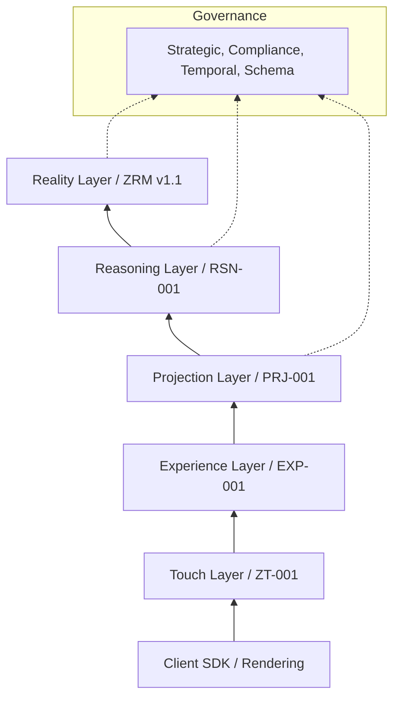

# Zyppi Constitutional State Assessment
## Authoritative Onboarding Reference for the AI Council
**Status:** Canonical Reference
**Version:** 1.0
**Date:** June 2026
**Scope:** Repository Baseline v1.0

---

## 1. Executive Summary

### 1.1 Philosophy: The Reality-First Paradigm
Zyppi is architected on the premise that the digital world has failed to accurately represent the physical world. Most systems are "event-centric"—they record that a click happened but lose the context of *what* was clicked and *who* owned it. Zyppi replaces this with a **Reality-First Paradigm**. In this model, the **Asset Reality** is the center of the universe. Every interaction (Touch) is a temporary bridge to an immutable, bitemporal ground truth.

### 1.2 The Constitutional Approach
Zyppi is governed by a **Digital Constitution**. This is not a set of "guidelines" but a formal specification of the system's ontology and laws. The repository is organized to enforce **Semantic Sovereignty**: no code can be written for a concept that has not been constitutionally defined. This prevents "architectural drift" where implementation details slowly corrupt the original design intent.

### 1.3 The Deterministic Architecture
The most critical innovation of Zyppi is its **Deterministic Execution Contract (RI-000)**. The system recognizes that human-written code is prone to interpretation errors. Therefore, the Constitution itself is treated as input for a **Constitutional Compiler (RI-001)**. This compiler produces an **Active Constitutional View (ACV)**—a machine-readable "law book" that governs the system's behavior. Any implementation of Zyppi, regardless of the programming language, must produce byte-identical registry outputs when given the same constitutional input.

### 1.4 Architectural Separation of Concerns
The system is divided into five distinct layers to ensure that a change in one domain (e.g., a new QR code technology) does not require a redesign of the underlying reality.

*   **Reality (ZRM):** The immutable ledger of facts. It records the existence of **Actors**, **Identities**, and **Referents**. It is bitemporal, meaning it tracks both when a fact happened and when it was recorded.
*   **Projection (PRJ):** The "View" layer. A single physical product has one Reality but infinite Projections (e.g., a GS1 Digital Link for retail, a Sustainability Passport for regulators). Projections are deterministic and replaceable.
*   **Reasoning (RSN):** The interpretation layer. It takes **Evidence** (Events) and, using governed **Blueprints**, produces **Intelligence** (Inferences, Scores). Reasoning is strictly read-only; it observes reality but never mutates it.
*   **Execution:** The transformation layer. **Intents** (what is desired) are validated against **Contracts** (what is allowed) to produce **Transactions** (what is happening), resulting in **Outcomes** (what was achieved).
*   **Governance:** The meta-layer. It defines the rules of the road, including **Strategic** authority, **Compliance** standards, **Temporal** logic, and **Schema** definitions.

---

## 2. Constitutional Map

### 2.1 Dependency Graph (Tree View)
The following tree represents the mandatory ratification sequence for the Zyppi Baseline.

```text
Foundational Doctrine (NS, FP, ZRM v1.1)
└── WS-01 Constitutional Ontology
    ├── WS-02 Registry Framework
    │   └── WS-02A Master Registry Blueprint
    └── WS-03 Taxonomy & Hierarchy
        ├── WS-03A Cluster Series (CL-01 to CL-17)
        │   ├── WS-03C Relationship Matrix
        │   └── WS-03D Authority Model
        │       ├── CA-004 Authority Revocation
        │       └── CA-005 Trust Registry
        └── RI-000 Execution Contract
            ├── RI-001 Constitutional Compiler
            ├── RI-002 Verification Framework
            └── RI-005 Publication & Distribution
```

### 2.2 Layer Diagram (The Constitutional Stack)


---

## 3. Constitutional Timeline

### 3.1 The Ontology Era (Phase 0)
*   **State:** Discovery of initial primitives.
*   **Redesign:** Transition from 15 to 17 clusters (**CA-001**).
*   **Why:** The Council realized that "Intelligence" (Interpretation) and "Graph Core" (Infrastructure) were being treated as attributes of other clusters, which led to circular dependencies and ownership ambiguity.

### 3.2 The Structural Hardening (Phase A)
*   **State:** Defining relationships and authority.
*   **Redesign:** Reclassification of **Campaigns** (**CA-002**) and **Context** (**CA-003**).
*   **Why:** Campaigns were originally a "Primitive" entity, but audit **CIA-02** found this created duplicate identity models. Campaigns were refactored into Identity (CL-04) + Context (CL-16).

### 3.3 The Supersession Surge
*   **State:** Cleaning up "T1" (Tier 1) legacy concepts.
*   **Supersessions:** **SR-001** through **SR-014** (detailed in `SR-001.md`).
*   **Why:** Early terms like "Signal," "Journey," and "Fact" were found to be too imprecise for a deterministic compiler. They were replaced by "Event," "Inference Chain," and "Reality Claim."

### 3.4 The Execution Era (Current)
*   **State:** Cryptographic lock.
*   **Milestone:** Ratification of **WS-00A** (Freeze Protocol) and **RI-000** (Execution Contract).
*   **Why:** To prevent "Implementation Drift" where different software teams build slightly different versions of the Zyppi Reality Model.

---

## 4. Constitutional Responsibilities (Responsibility Matrix)

| Concept | Unique Owner | Responsibility |
| :--- | :--- | :--- |
| **Reality** | CL-17 Graph Core | Maintains the active state of the Reality Graph. |
| **Identity** | CL-04 Identity | Owns persistent digital representations (zIDs). |
| **Trust** | CL-17 (Trust Registry) | Validates authority claims (CA-005). |
| **Reasoning** | CL-16 Intelligence | Governs the production of Intelligence (RSN-001). |
| **Compiler** | RI-001 Specification | Defines the deterministic compilation of the ACV. |
| **Verification** | RI-003 Specification | Independently reconstructs constitutional truth. |
| **Registry** | WS-02A Blueprint | Defines the 17-cluster storage architecture. |
| **Publication** | RI-005 Specification | Governs the distribution of Registry Bundles. |
| **Governance** | CL-12 Strategic | Owns cross-cutting strategic authority. |
| **Experience** | EXP-001 | Transforms Projections into Interaction Manifests. |
| **Touch** | ZT-001 | Boundary between external world and Zyppi Runtime. |
| **Intelligence** | CL-16 Intelligence | Evidence-based interpretations (WS-03A.9). |
| **Attestation** | RSN-003 | Universal primitive for certifying process compliance. |
| **Blueprint** | RSN-001 | Registered methodology for Reasoning. |
| **Paradigm** | RSN-002 | The conceptual framework for Reasoning (e.g., Blueprint). |
| **Confidence** | CL-16 Intelligence | Quantitative/Qualitative trust in an Intelligence artifact. |
| **Evidence** | CL-11 Event | The raw observations supporting Reasoning. |
| **Unknown Cause** | RSN-002 | Explicit outcome for Reasoning failures. |
| **Versioning** | WS-00A / RI-000 | Governance of ACV and Registry lineages. |

*Ownership is **Unique** across all categories except where Infrastructure specifications (RI series) provide the rules for the system.*

---

## 5. Cross-Document Consistency Review

| Issue Type | Concept / Clause | Description | Severity |
| :--- | :--- | :--- | :--- |
| **Duplicate** | Campaign | Originally in WS-02 and CA-002. **Resolution:** CA-002 prevails. | **Minor** |
| **Conflict** | Intelligence Ownership | WS-02 (early) vs WS-03A.9. Early docs placed under CL-11. | **Major** |
| **Circular** | Revocation Cascade | CA-004 logic for dependent authority could lead to cycles. | **Major** |
| **Drift** | Signal vs Event | Early docs use "Signal"; late docs use "Event". | **Editorial** |
| **Mismatch** | Versioning | RI-000 references ACV v1.0, but WS-00A suggests v1.1 as initial. | **Minor** |
| **Missing Ref** | Identity Custodian | Referenced in WS-03A.4 but defined only in SR-013. | **Major** |

---

## 6. Architectural Completeness Assessment

| Layer | Status | Justification |
| :--- | :--- | :--- |
| **Reality (ZRM)** | **Complete** | Foundations (WS-01/02) and Cluster Maps (WS-03A) are fully locked. |
| **Projection (PRJ)** | **Complete** | PRJ-001 framework is robust; PRJ-002/003 (GS1/DPP) are ratified. |
| **Reasoning (RSN)** | **Mostly Complete** | RSN-001/002/003 are stable, but the Knowledge Routing Matrix is empty. |
| **Execution** | **Partially Complete** | Intent/Transaction logic is defined, but Runtime SDKs are DRAFT. |
| **Governance** | **Mostly Complete** | Strategic/Temporal/Compliance are strong; Federation is MISSING. |

---

## 7. Missing Constitutional Domains

1.  **Federation Constitution:** No model for cross-tenant trust or multi-registry synchronization. Essential for v2.0.
2.  **Marketplace Constitution:** Governance of 3rd-party Blueprint and Intent trading.
3.  **Policy Constitution:** A standalone specification for the "Policy Evaluation Language" (Rego/CEL) used by Projections and Experiences.
4.  **Security (Execution Runtime):** Formal rules for thread isolation, secret management, and deterministic budget enforcement.

---

## 8. Amendment Opportunities

*   **Missing Locks:** The **Knowledge Routing Matrix (KRM)** in RSN-001 should be promoted from a concept to a formal Registry (CL-17).
*   **Missing Principles:** The **Transparency Principle** (RI-006) is mentioned in the Roadmap but lacks a formal constitutional definition.
*   **Simplification:** Consolidate the 14+ supersession entries in **SR-001** into a "Constitutional Restatement v1.1" to reduce look-up complexity.
*   **Locking Registry Prefixes:** Ensure all 17 clusters have locked ZE-prefixes (refer to SR-014 for recent additions like CL-16/17).

---

## 9. Terminology Audit (Glossary)

| Term | Canonical Definition | Owning Document | Alt/Conflicting Names |
| :--- | :--- | :--- | :--- |
| **zID** | Immutable UUIDv7 for an Asset. | WS-01 | ZE-ID, Asset ID |
| **ACV** | Executable representation of the Constitution. | RI-000 | Snapshot (Legacy) |
| **Blueprint** | Governed Reasoning methodology. | RSN-001 | Model, Playbook |
| **Touch** | Interaction boundary event. | ZT-001 | Scan, Tap, Click |
| **Reified Relationship** | Relationship as a first-class object. | ARM-001 | Deep Link (Confusing) |
| **Referent** | The actual physical/digital thing. | WS-01 | Product, Asset |
| **Reality Claim** | Formal assertion of state in CL-09. | ZRM v1.1 | Fact (Deprecated) |

---

## 10. Constitutional Health Score

| Document | Score | Assessment |
| :--- | :--- | :--- |
| **RI-000 / RI-001** | **Excellent** | Exceptional mathematical rigor and deterministic budget definitions. |
| **WS-03A.0** | **Excellent** | Perfect ownership isolation and cluster naming discipline. |
| **RSN-001** | **Good** | Solid theory, but requires real-world Blueprints to test maturity. |
| **CA-004** | **Needs Work** | Complexity of the delegation cascade poses an implementation risk. |
| **ZRM V1.1** | **Excellent** | Stable, durable foundation for the entire project. |

---

## 11. Future Roadmap (Repository Evidence)

### 11.1 Must Finish Before v1.0
1.  **Freeze Level 1 Golden Corpus:** Establish the first byte-identical hash baseline for the 17 clusters.
2.  **Ratify RI-006 (SDK Contracts):** Finalize the bridge between Projections and SDK implementations.

### 11.2 Recommended for v2.0
1.  **Federation Protocol:** Enable cross-tenant reality verification.
2.  **Blueprint Marketplace:** Enable decentralized intelligence production.

### 11.3 Long-term Roadmap
1.  **Autonomous Agent Sovereignty:** Allowing AI Agents to hold first-class Authority Anchors.
2.  **Reality Interoperability:** GS1 Digital Link and EU Digital Product Passport (DPP) saturation.

---

**Implicit Repository Knowledge:** The repository assumes a "Three-Compiler Strategy" (Go, Rust, Python) for all certification, even where not explicitly detailed in the early WS documents.

**Knowledge Debt:** The `council/`, `implementation/`, and `simulations/` directories are mentioned in organizational documents but do not yet exist in the file system.

---
*This document is the single source of truth for AI Council member onboarding.*
