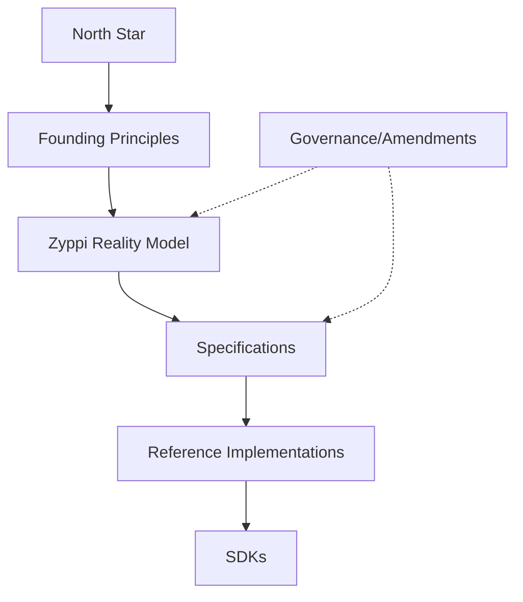

# 02 CONSTITUTIONAL HIERARCHY

## Foundational
- **FOUNDING-PRINCIPLES**: Zyppi Founding Principles v3.0 (./FOUNDING-PRINCIPLE-v3.md)
- **FOUNDING-PRINCIPLES**: Zyppi Founding Principles v4.2 (./FOUNDING-PRINCIPLES.md)
- **NORTH-STAR**: Zyppi: North Star Blueprint V4.0 (./NORTH-STAR-V4.0.md)
- **NORTH-STAR**: NORTH STAR v5.0 (./NORTH-STAR.md)
- **FOUNDING-PRINCIPLES**: Zyppi Founding Principles v4.2 (./constitution/FOUNDING-PRINCIPLES-V4.2.md)
- **NORTH-STAR**: NORTH STAR v5.0 (./constitution/NORTH-STAR-V5.md)

## ZRM (Reality Model)
- **ZRM-V1.1**: ZRM v1.1 (./ZRM V1.1.md)
- **Unknown**: ZRM-000 (./constitution/ZRM-000.md)
- **Unknown**: ZRM-001 — Constitutional Foundations (./constitution/ZRM-001.md)
- **Unknown**: ZRM-002 Constitutional Input Sheet (./constitution/ZRM-002-INPUT-SHEET-v1.0.md)
- **Unknown**: ZRM-002-ONTOLOGY-MATRIX.md (./constitution/ZRM-002-ONTOLOGY-MATRIX.md)
- **ZRM-002**: ZRM-002 — Core Ontology (./constitution/ZRM-002-REVIEW-CHECKLIST.md)
- **ZRM-002**: ZRM-002 — Core Ontology (./constitution/ZRM-002-SECTION-OUTLINE.md)
- **Unknown**: ZRM-002A — Subject Primitive (./constitution/ZRM-002A.md)
- **Unknown**: ZRM-002B — Identity (./constitution/ZRM-002B.md)
- **Unknown**: ZRM-003-EP (./constitution/ZRM-003-EP.md)
- **Unknown**: Unknown (./constitution/ZRM-003-IMPLEMENTATION-PLAN-AND-GUIDELINES.md)
- **Unknown**: Unknown (./constitution/ZRM-003-MASTER-BLUEPRINT.md)
- **Unknown**: ZRM-003 (./constitution/ZRM-003-Math-pipeline.md)
- **Unknown**: ZRM-003 - CONSTITUTIONAL BENCHMARK SUITE (./constitution/ZRM-003-STAGE-0-CONSTITUTIONAL-BENCHMARK-SUITE.md)
- **Unknown**: ZRM-003 — Stage 2: Constitutional Axiom Workshop (./constitution/ZRM-003-STAGE-2.md)
- **Unknown**: ZRM v2.0 Master Blueprint v3.0 (./constitution/ZRM-2-MASTER-BLUEPRINT.md)
- **Unknown**: Proposed ZRM v2.0 Document Architecture (./constitution/ZRM-V2-IMPLEMENTATION-PLAN.md)
- **Unknown**: ZRM v2 Ratification Index (./constitution/ZRM-V2-RATIFICATION-INDEX.md)
- **Unknown**: RTC-ZRM-003-S3 (./constitution/ratified/RTC/RTC-ZRM-003-S3.md)
- **Unknown**: RTC-ZRM-003-S3A (./constitution/ratified/RTC/RTC-ZRM-003-S3A.md)
- **Unknown**: RTC-ZRM-003-S3B (./constitution/ratified/RTC/RTC-ZRM-003-S3B.md)
- **Unknown**: RTC-ZRM-003-S3C (./constitution/ratified/RTC/RTC-ZRM-003-S3C.md)
- **Unknown**: RTC-ZRM-003-S4 (./constitution/ratified/RTC/RTC-ZRM-003-S4.md)
- **Unknown**: RTC-ZRM-003A-R1A — Identity Mathematics Classification & Purification (./constitution/ratified/RTC/RTC-ZRM-003A-R1A.md)
- **Unknown**: RTC-ZRM-003A-R2 — Identity Mathematics Theorem Ratification Framework (./constitution/ratified/RTC/RTC-ZRM-003A-R2.md)
- **Unknown**: RTC-ZRM-003A-R2B — Formal Proof of TH-030: Identity Atomicity (./constitution/ratified/RTC/RTC-ZRM-003A-R2B.md)
- **Unknown**: RTC-ZRM-003A-R2C — Formal Proof of TH-018: Identity Non-Transferability (./constitution/ratified/RTC/RTC-ZRM-003A-R2C.md)
- **Unknown**: RTC-ZRM-003A-R2D — Formal Proof of TH-034: Representation Independence (./constitution/ratified/RTC/RTC-ZRM-003A-R2D.md)
- **Unknown**: RTC-ZRM-003A-R2E — Formal Evaluation of TH-031: Identity Independence (./constitution/ratified/RTC/RTC-ZRM-003A-R2E.md)
- **Unknown**: RTC-ZRM-003A-R3 (./constitution/ratified/RTC/RTC-ZRM-003A-R3.md)
- **Unknown**: RTC-ZRM-003A — Identity Mathematics Framework (./constitution/ratified/RTC/RTC-ZRM-003A.md)
- **Unknown**: RTC-ZRM-003B-R1 — Event Mathematics Candidate Discovery (./constitution/ratified/RTC/RTC-ZRM-003B-R1.md)
- **Unknown**: RTC-ZRM-003B-R1A — Event Mathematics Classification & Purification (./constitution/ratified/RTC/RTC-ZRM-003B-R1A.md)
- **Unknown**: RTC-ZRM-003B-R2 (./constitution/ratified/RTC/RTC-ZRM-003B-R2.md)
- **Unknown**: RTC-ZRM-003B-R2A (./constitution/ratified/RTC/RTC-ZRM-003B-R2A.md)
- **Unknown**: RTC-ZRM-003B-R2B (./constitution/ratified/RTC/RTC-ZRM-003B-R2B.md)
- **Unknown**: RTC-ZRM-003B-R2C (./constitution/ratified/RTC/RTC-ZRM-003B-R2C.md)
- **Unknown**: RTC-ZRM-003B-R2D (./constitution/ratified/RTC/RTC-ZRM-003B-R2D.md)
- **Unknown**: RTC-ZRM-003B-R2E (./constitution/ratified/RTC/RTC-ZRM-003B-R2E.md)
- **Unknown**: RTC-ZRM-003B-R2F — Formal Proof of TH-E006 (Event Composition) (./constitution/ratified/RTC/RTC-ZRM-003B-R2F.md)
- **Unknown**: RTC-ZRM-003B-R2G — Formal Proof of TH-E012 (Event Idempotence) (./constitution/ratified/RTC/RTC-ZRM-003B-R2G.md)
- **Unknown**: RTC-ZRM-003B-R2H — Formal Proof of TH-E013 (Event Liveness) (./constitution/ratified/RTC/RTC-ZRM-003B-R2H.md)
- **Unknown**: RTC-ZRM-003B-R2I — Formal Proof of TH-E014 (Event Finality) (./constitution/ratified/RTC/RTC-ZRM-003B-R2I.md)
- **Unknown**: RTC-ZRM-003B-R3 — Event Mathematics Constitutional Registry Freeze (./constitution/ratified/RTC/RTC-ZRM-003B-R3.md)
- **Unknown**: RTC-ZRM-003B (./constitution/ratified/RTC/RTC-ZRM-003B.md)
- **Unknown**: RTC-ZRM-003C-I1 (./constitution/ratified/RTC/RTC-ZRM-003C-I1.md)
- **Unknown**: RTC-ZRM-003C-R1 (./constitution/ratified/RTC/RTC-ZRM-003C-R1.md)
- **Unknown**: RTC-ZRM-003C-R1A (./constitution/ratified/RTC/RTC-ZRM-003C-R1A.md)
- **Unknown**: RTC-ZRM-003C-R2 (./constitution/ratified/RTC/RTC-ZRM-003C-R2.md)
- **Unknown**: RTC-ZRM-003C-R2A (./constitution/ratified/RTC/RTC-ZRM-003C-R2A.md)
- **Unknown**: RTC-ZRM-003C-R2B (./constitution/ratified/RTC/RTC-ZRM-003C-R2B.md)
- **Unknown**: RTC-ZRM-003C-R2C (./constitution/ratified/RTC/RTC-ZRM-003C-R2C.md)
- **Unknown**: RTC-ZRM-003C-R2D (./constitution/ratified/RTC/RTC-ZRM-003C-R2D.md)
- **Unknown**: RTC-ZRM-003C-R2E (./constitution/ratified/RTC/RTC-ZRM-003C-R2E.md)
- **Unknown**: RTC-ZRM-003C-R3 (./constitution/ratified/RTC/RTC-ZRM-003C-R3.md)
- **Unknown**: RTC-ZRM-003C — Time Mathematics Discovery Framework (./constitution/ratified/RTC/RTC-ZRM-003C.md)
- **Unknown**: RTC-ZRM-003D-R1 (./constitution/ratified/RTC/RTC-ZRM-003D-R1.md)
- **Unknown**: RTC-ZRM-003D-R1A (./constitution/ratified/RTC/RTC-ZRM-003D-R1A.md)
- **Unknown**: RTC-ZRM-003D-R2 (./constitution/ratified/RTC/RTC-ZRM-003D-R2.md)
- **Unknown**: RTC-ZRM-003D-R2A (./constitution/ratified/RTC/RTC-ZRM-003D-R2A.md)
- **Unknown**: RTC-ZRM-003D-R2B (./constitution/ratified/RTC/RTC-ZRM-003D-R2B.md)
- **Unknown**: RTC-ZRM-003D-R2C (./constitution/ratified/RTC/RTC-ZRM-003D-R2C.md)
- **Unknown**: RTC-ZRM-003D-R2D (./constitution/ratified/RTC/RTC-ZRM-003D-R2D.md)
- **Unknown**: RTC-ZRM-003D-R2E (./constitution/ratified/RTC/RTC-ZRM-003D-R2E.md)
- **Unknown**: RTC-ZRM-003D-R2F (./constitution/ratified/RTC/RTC-ZRM-003D-R2F.md)
- **Unknown**: RTC-ZRM-003D — State Mathematics Discovery Framework (./constitution/ratified/RTC/RTC-ZRM-003D.md)
- **Unknown**: ZRM-003-EP (./constitution/ratified/RTC/ZRM-003-EP.md)
- **Unknown**: ZRM-003-STAGE-1 (./constitution/ratified/ZRM-003/ZRM--003-STAGE-1.md)
- **Unknown**: Constitutional Amendment Proposal (./constitution/ratified/ZRM-003/ZRM-003-3A-AMD-001.md)
- **Unknown**: ZRM-003 (./constitution/ratified/ZRM-003/ZRM-003-Math-pipeline.md)
- **Unknown**: ZRM-003-S5A (./constitution/ratified/ZRM-003/ZRM-003-S5A.md)
- **Unknown**: ZRM-003-S5B (./constitution/ratified/ZRM-003/ZRM-003-S5B.md)
- **Unknown**: ZRM-003-S5C (./constitution/ratified/ZRM-003/ZRM-003-S5C.md)
- **Unknown**: ZRM-003 - CONSTITUTIONAL BENCHMARK SUITE (./constitution/ratified/ZRM-003/ZRM-003-STAGE-0-CONSTITUTIONAL-BENCHMARK-SUITE.md)
- **Unknown**: ZRM-003 — Stage 2: Constitutional Axiom Workshop (./constitution/ratified/ZRM-003/ZRM-003-STAGE-2.md)
- **Unknown**: ZRM-003 — Stage 3 (./constitution/ratified/ZRM-003/ZRM-003-STAGE-3.md)
- **Unknown**: ZRM-003-STAGE-3A-CANDIDATE-REGISTRY (./constitution/ratified/ZRM-003/ZRM-003-STAGE-3A-CANIDATE-REGISTERY.md)
- **Unknown**: ZRM-003-STAGE-3A — Constitutional Theorem Discovery (./constitution/ratified/ZRM-003/ZRM-003-STAGE-3A.md)
- **Unknown**: ZRM-003-STAGE-1 (./constitution/ratified/ZRM-003/ZRM-003-Stage-1.md)

## WS (Specifications)
- **Unknown**: WS-01 CONSTITUTIONAL ONTOLOGY SPECIFICATION (./constitution/ratified/WS-001.md)
- **Unknown**: WS-03 Revision 1 (./constitution/ratified/WS-003 Revision 1.md)
- **Unknown**: WS-00A - Constitutional Closure & Freeze Protocol (./constitution/ratified/WS-00A.md)
- **Unknown**: WS-01A Amendment A-002 (./constitution/ratified/WS-01A Amendment A-002.md)
- ****: WS-01A — CONSTITUTIONAL AMENDMENT A-001 (./constitution/ratified/WS-01A — CONSTITUTIONAL AMENDMENT A-001.md)
- **Unknown**: WS-02 — Core Entity Registry Specification (./constitution/ratified/WS-02 — Core Entity Registry Specification.md)
- **Unknown**: WS-02A — MASTER ENTITY REGISTRY BLUEPRINT (./constitution/ratified/WS-02A.md)
- **Unknown**: WS-03 Entity Taxonomy & Hierarchy Validation (./constitution/ratified/WS-03.md)
- **Unknown**: WS-03A.0 — CONSTITUTIONAL CLUSTER MAP (./constitution/ratified/WS-03A.0.md)
- **Unknown**: WS-03A.1 — CL-11 Event Taxonomy Map (./constitution/ratified/WS-03A.1.md)
- ****: WS-03A.2 Revision 1 (./constitution/ratified/WS-03A.2 Revision 1.md)
- **Unknown**: WS-03A.2 — Hierarchy Classification Framework (./constitution/ratified/WS-03A.2.md)
- **Unknown**: WS-03A.3 — CL-05 Referent Taxonomy Map (./constitution/ratified/WS-03A.3.md)
- **Unknown**: WS-03A.4 (./constitution/ratified/WS-03A.4.md)
- **- Purchase Contract**: WS-03A.5 — CL-07 Intent Contract Constitutional Governance Frame (./constitution/ratified/WS-03A.5.md)
- **Unknown**: WS-03A.6 — CL-09 Transaction Taxonomy Map (./constitution/ratified/WS-03A.6.md)
- **Unknown**: WS-03A.7 — CL-10 Outcome Taxonomy Map (./constitution/ratified/WS-03A.7.md)
- **Unknown**: WS-03A.8 — CL-11 Event Taxonomy Map (./constitution/ratified/WS-03A.8.md)
- **Unknown**: 1. Purpose (./constitution/ratified/WS-03A.9.md)
- **- Actor parent of Referent**: WS-03C — Cross-Cluster Relationship Matrix Constitution (./constitution/ratified/WS-03C.md)
- **Employment Contract**: WS-03D Amendment — Authority Anchor Model (./constitution/ratified/WS-03D.md)
- **Unknown**: WS-03F — Registry Population Hardening Amendment Package (./constitution/ratified/WS-03F.md)
- **Unknown**: WS-04A.1 (./constitution/ratified/WS-04A.1.md)
- **Unknown**: WS-04B — Relationship Registry Architecture (./constitution/ratified/WS-04B.md)
- **Unknown**: WS-05A — Master Registry Population Charter (./constitution/ratified/WS-05A.md)
- **Unknown**: WS-05B — Master Registry Population Plan (./constitution/ratified/WS-05B.md)
- **Unknown**: WS-05C — Cluster Admission Rules (./constitution/ratified/WS-05C.md)
- **Unknown**: WS-05D — Population Validation & Tooling (./constitution/ratified/WS-05D.md)
- **Unknown**: WS-05E — Certification & Authorization (./constitution/ratified/WS-05E.md)

## RI (Reference Implementations)
- **RI-000**: RI-000 — Execution Contract v1.0 (./constitution/ratified/RI-000.md)
- **RI-001**: Part I — Foundations (./constitution/ratified/RI-001.md)
- **RI-002**: Part I — Foundations (./constitution/ratified/RI-002.md)
- **RI-003**: RI-003 — Constitutional Verification Framework (./constitution/ratified/RI-003.md)
- **RI-004**: ── RI-004A: Population Planner ────────────────────────────────────── (./constitution/ratified/RI-004.md)
- **Unknown**: RI-005 — Registry Publication & Distribution Framework (./constitution/ratified/RI-005.md)
- **Unknown**: RI-006.A — Runtime Foundations (./constitution/ratified/RI-006.A.md)
- **Unknown**: RI-006.B — Runtime Lifecycle (./constitution/ratified/RI-006.B.md)
- **Unknown**: RI-006.C — Runtime Lifecycle & Execution Context (./constitution/ratified/RI-006.C.md)
- **Unknown**: RI-006.D — Runtime Resolution Engine (./constitution/ratified/RI-006.D.md)
- **Unknown**: RI-006.E — Runtime Evidence & Explainability (./constitution/ratified/RI-006.E.md)
- **Unknown**: RI-006.F — Runtime Constitutional Contracts (./constitution/ratified/RI-006.F.md)

## RSN (Reasoning)

## Governance/Amendments

## Developer/Platform

## Supporting/Drafts
- **Unknown**: Change Log: SDK-SPEC-001-v3.md (./CHANGE-LOG-SDK-001-v3.md)
- **Unknown**: Change Report: SDK-SPEC-001-v2.md (./CHANGE-REPORT-SDK-001-v2.md)
- **DATA-MODEL**: Zyppi Data Model Bible v3 (./DATA-MODEL.md)
- **Unknown**: Council Structure (./Jules-and-council.md)
- **PRD**: Zyppi Product Requirements Document (PRD) (./PRD.md)
- **Unknown**: Unknown (./README.md)
- **ROADMAP**: **ZRM Implementation Roadmap & Execution Plan** (./ROADMAP.md)
- **TECH-ARCH**: Zyppi Technical Architecture Bible (./TECH-ARCHITECTURE.md)
- **STATE-OF-THE-UNION**: ZYPPI CONSTITUTIONAL STATE OF THE UNION (v1.1) (./ZYPPI_CONSTITUTIONAL_STATE_OF_THE_UNION_v1.1.md)
- **Unknown**: CMP-001 — Constitutional Master Plan (./constitution/CMP-001.md)
- **EA-001**: SDK-SPEC-001 Constitutional Resolution Log (CRL) (./constitution/CRL-SDK-001.md)
- **Unknown**: CRL-SDK-002 — SDK-SPEC-001-v2.md Constitutional Resolution Log (./constitution/CRL-SDK-002.md)
- **Unknown**: CAA-001 (./constitution/Economic/CAA-001.md)
- **Unknown**: CEP-001 (./constitution/Economic/CEP-001.md)
- **Unknown**: CMS-001 (./constitution/Economic/CMS-001.md)
- **Unknown**: EAA-001 (./constitution/Economic/EAA-001.md)
- **Unknown**: NEA-001 (./constitution/Economic/NEA-001.md)
- **Unknown**: ZEA-001 (./constitution/Economic/ZEA-001.md)
- **Unknown**: Zyppi: The Constitutional Economic Architecture (./constitution/Economic/Zyppi-Economic-Architecture-overview.md)
- **Unknown**: ROUNDTABLE-METHODOLOGY.md (./constitution/Roundtable-methodology.md)
- **Unknown**: What is Zyppi? (./constitution/What-is-Zyppi-v3.md)
- **Unknown**: Zyppi: The Constitutional Economic Architecture (./constitution/Zyppi-Economic-Architecture-overview.md)
- ****: AMENDMENT A-001 (./constitution/ratified/AMENDMENT A-001.md)
- **Unknown**: ARM-001 Asset Reality Model (./constitution/ratified/ARM-001.md)
- **Unknown**: ARM-P-001 — Product Profile Constitution (./constitution/ratified/ARM-P-001.md)
- **Unknown**: Constitutional Amendment CA-001 (./constitution/ratified/CA-001.md)
- **Unknown**: Constitutional Amendment CA-002 (./constitution/ratified/CA-002.md)
- ****: CA-003 — Unified Context Model Amendment (./constitution/ratified/CA-003.md)
- **Unknown**: Constitutional Amendment CA-004 (./constitution/ratified/CA-004.md)
- **Unknown**: CA-005 — Trust Registry Constitutional Definition (./constitution/ratified/CA-005.md)
- **Unknown**: CCD-001 — WS-03A.0 / WS-04A Co-Dependency Clarification (./constitution/ratified/CCD-001.md)
- **Unknown**: CFR-001 — Constitutional Freeze Report (./constitution/ratified/CFR-001.md)
- **Unknown**: Constitutional Architecture Council (./constitution/ratified/CR-001.md)
- **Unknown**: DEV-ARCH-001 (./constitution/ratified/DEV-ARCH-001.md)
- **Unknown**: DJ-001 — Developer Journey 001 (./constitution/ratified/DJ-001.md)
- **Unknown**: DJ-002 — Developer Journey 002 (./constitution/ratified/DJ-002.md)
- **Unknown**: DJ-003 — Developer Journey 003 (./constitution/ratified/DJ-003.md)
- **Unknown**: DJ-004 — Developer Journey 004 (./constitution/ratified/DJ-004.md)
- **Unknown**: DJ-005 — Developer Journey 005 (./constitution/ratified/DJ-005.md)
- **Unknown**: DJ-006 — Developer Journey 006 (./constitution/ratified/DJ-006.md)
- **Unknown**: DJ-007 — Developer Journey 7 (./constitution/ratified/DJ-007.md)
- **Unknown**: DJ-008 — Developer Journey 008 (./constitution/ratified/DJ-008.md)
- **Unknown**: DJ-009 — Developer Journey 009 (./constitution/ratified/DJ-009.md)
- **Unknown**: DMR-001 — Constitutional Dependency Map Revision (./constitution/ratified/DMR-001.md)
- **actor_context**: EXP-001 — Experience Constitution (./constitution/ratified/EXP-001.md)
- **Unknown**: GNSR-001 — Global Naming Synchronization Report (./constitution/ratified/GNSR-001.md)
- **Unknown**: GNSR-002 — WS-03F Constitutional Synchronization Report (./constitution/ratified/GNSR-002.md)
- **Unknown**: 6. Builder Paradigm (./constitution/ratified/PLATFORM-SPEC-001.md)
- **Unknown**: POL-001.A — Policy Foundations (./constitution/ratified/POL-001.A.md)
- **Unknown**: POL-001.B — Authority & Delegation (./constitution/ratified/POL-001.B.md)
- **Unknown**: POL-001.C — Authorization & Constitutional Decisioning (./constitution/ratified/POL-001.C.md)
- **Unknown**: POL-001.D — Policy Lifecycle & Temporal Governance (./constitution/ratified/POL-001.D.md)
- **Unknown**: POL-001.E — Federation, Emergency & Constitutional Governance (./constitution/ratified/POL-001.E.md)
- **Unknown**: POL-001.F — Runtime Constitutional Contracts (./constitution/ratified/POL-001.F.md)
- **Unknown**: PRJ-001 — Projection Architecture Constitution (./constitution/ratified/PRJ-001.md)
- **Unknown**: PRJ-002 — GS1 Digital Link Projection Specification (./constitution/ratified/PRJ-002.md)
- **Unknown**: PRJ-003 — Digital Product Passport Projection Specification (./constitution/ratified/PRJ-003.md)
- **Unknown**: RSN-001 — Universal Reasoning Constitution (./constitution/ratified/RSN-001-V2.0.md)
- **Unknown**: RSN-001 — Reasoning Constitution (./constitution/ratified/RSN-001.md)
- **Unknown**: RSN-002 — Methodology Registry Constitution (./constitution/ratified/RSN-002.md)
- **Unknown**: RSN-003 Constitutional Resolution (CR-001) (./constitution/ratified/RSN-003.md)
- **ROADMAP**: ZRM FOUNDATION STABILIZATION & EXECUTION ROADMAP (./constitution/ratified/Roadmap.md)
- **Unknown**: SEC-001 Amendment No. 1 (./constitution/ratified/SCEA-001.md)
- **Unknown**: SDK-SPEC-001 — Zyppi SDK Constitutional Specification (./constitution/ratified/SDK-SPEC-001-PROGRESS.md)
- **Unknown**: SDK-SPEC-001 — Zyppi SDK Constitutional Specification (./constitution/ratified/SDK-SPEC-001-v2.md)
- **Unknown**: SDK-SPEC-001 — Zyppi SDK Constitutional Specification (./constitution/ratified/SDK-SPEC-001-v3.md)
- **Unknown**: SDK-SPEC-001 — Zyppi SDK Constitutional Specification (./constitution/ratified/SDK-SPEC-001.md)
- **Unknown**: SEC-001 (./constitution/ratified/SEC-001.md)
- **Unknown**: SR-001 (SR-000.5) — Constitutional Supersession Register (./constitution/ratified/SR-001(0.5).md)
- **Unknown**: SR-001 — Constitutional Supersession Register Update (./constitution/ratified/SR-001.md)
- **Unknown**: ZT-001 — Zyppi Touch Constitution (./constitution/ratified/ZT-001.md)

## Authority Flow

## Related Reports

- [01 DOCUMENT REGISTRY](01_DOCUMENT_REGISTRY.md)
- [03 DEPENDENCY GRAPH](03_DEPENDENCY_GRAPH.md)
- [04 CITATION INDEX](04_CITATION_INDEX.md)
- [05 CONCEPT INDEX](05_CONCEPT_INDEX.md)
- [06 DOCUMENT SUMMARIES](06_DOCUMENT_SUMMARIES.md)
- [07 KNOWLEDGE GRAPH](07_KNOWLEDGE_GRAPH.md)
- [08 DISCOVERY FINDINGS](08_DISCOVERY_FINDINGS.md)
- [09 DISCOVERY EXECUTIVE SUMMARY](09_DISCOVERY_EXECUTIVE_SUMMARY.md)
