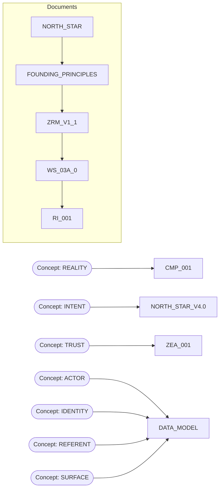

# 07 KNOWLEDGE GRAPH

## Constitutional Knowledge Flow

## Related Reports

- [01 DOCUMENT REGISTRY](01_DOCUMENT_REGISTRY.md)
- [02 CONSTITUTIONAL HIERARCHY](02_CONSTITUTIONAL_HIERARCHY.md)
- [03 DEPENDENCY GRAPH](03_DEPENDENCY_GRAPH.md)
- [04 CITATION INDEX](04_CITATION_INDEX.md)
- [05 CONCEPT INDEX](05_CONCEPT_INDEX.md)
- [06 DOCUMENT SUMMARIES](06_DOCUMENT_SUMMARIES.md)
- [08 DISCOVERY FINDINGS](08_DISCOVERY_FINDINGS.md)
- [09 DISCOVERY EXECUTIVE SUMMARY](09_DISCOVERY_EXECUTIVE_SUMMARY.md)
