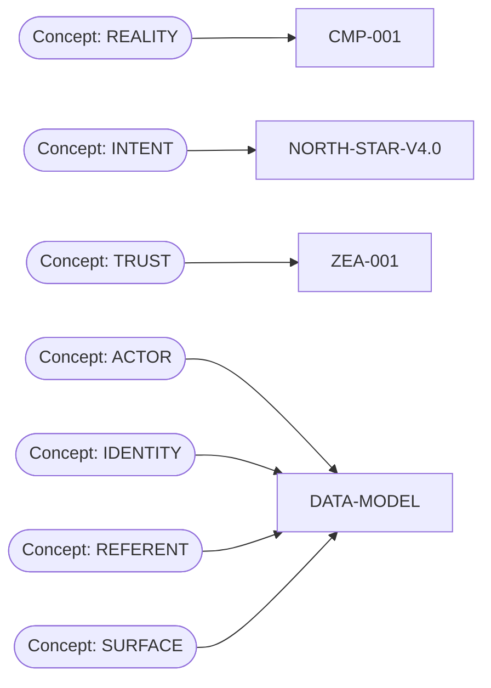

# 07 KNOWLEDGE GRAPH

## Related Reports

- [00 MISSION EXECUTIVE SUMMARY](00_MISSION_EXECUTIVE_SUMMARY.md)
- [01 DOCUMENT REGISTRY](01_DOCUMENT_REGISTRY.md)
- [02 CONSTITUTIONAL HIERARCHY](02_CONSTITUTIONAL_HIERARCHY.md)
- [03 DEPENDENCY GRAPH](03_DEPENDENCY_GRAPH.md)
- [04 CITATION INDEX](04_CITATION_INDEX.md)
- [05 CONCEPT INDEX](05_CONCEPT_INDEX.md)
- [06 DOCUMENT SUMMARIES](06_DOCUMENT_SUMMARIES.md)
- [08 DISCOVERY FINDINGS](08_DISCOVERY_FINDINGS.md)
- [09 DIRECTORY RESTRUCTURE PROPOSAL](09_DIRECTORY_RESTRUCTURE_PROPOSAL.md)
- [10 MIGRATION PLAN](10_MIGRATION_PLAN.md)
- [11 DUPLICATE AND SUPERSESSION ANALYSIS](11_DUPLICATE_AND_SUPERSESSION_ANALYSIS.md)
- [12 CANONICAL NAMING STANDARD](12_CANONICAL_NAMING_STANDARD.md)
- [13 ORPHAN ANALYSIS](13_ORPHAN_ANALYSIS.md)
- [14 CONFLICT ANALYSIS](14_CONFLICT_ANALYSIS.md)
- [15 GAP ANALYSIS](15_GAP_ANALYSIS.md)
- [16 AI NAVIGATION INDEX](16_AI_NAVIGATION_INDEX.md)
- [17 REPOSITORY HEALTH SCORE](17_REPOSITORY_HEALTH_SCORE.md)
