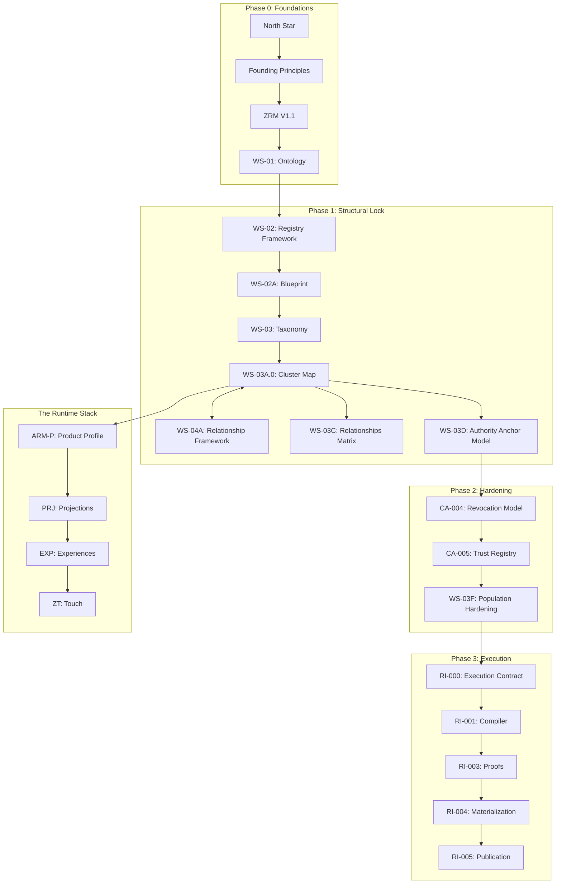

# ZYPPI CONSTITUTIONAL STATE OF THE UNION (v1.0)
## The Authoritative Orientation & Onboarding Guide for the AI Council
**Status:** Canonical Baseline
**Date:** June 2026
**Scope:** Repository Baseline v1.0 (Execution Era)

---

## 1. Executive Summary

### 1.1 The Reality-First Mission
Zyppi is the **Intent Distribution Infrastructure** for the physical internet (Ref: `NORTH-STAR.md`, §"North Star"). It exists to bridge the gap between physical interactions (Touch) and digital execution by preserving the **Asset Reality** across time, jurisdiction, and interface. Unlike legacy event-centric systems, Zyppi treats relationships as permanent and interactions as transient.

### 1.2 The State of the Union: Execution Era
As of June 2026, Zyppi has successfully transitioned from the **Ontology Era** (Phase 0: defining what things are) to the **Execution Era** (Phase 3: enforcing what things do). The "Constitution" is no longer a collection of documents; it is the **Input Specification for a Deterministic Compiler chain** (Ref: `RI-001`, §1, ¶1).

The architecture is now **Locked**, **Ratified**, and **Mathematically Deterministic**. Every compliant implementation (Go, Rust, Python) must produce byte-identical registry outputs from the same constitutional inputs.

---

## 2. Constitutional Philosophy

### 2.1 Reality-First Paradigm
Legacy systems record "Events" (e.g., clicks). Zyppi records "Reality" (e.g., the relationship between an Actor and a Referent). Events are transient; Relationships are permanent. (Ref: `ZRM v1.1`, §6.17, ¶1)

### 2.2 Semantic Sovereignty
No code can be written for a concept that has not been constitutionally ratified. Semantic ownership precedes implementation. (Ref: `WS-01`, §1, ¶2; `WS-05A`, §1, ¶1)

### 2.3 Mathematical Determinism
The integrity of the "Digital Constitution" is protected by **RFC 8785 JSON Canonicalization** and **SHA-256 Integrity Hashes**. The registry is not "built" by humans; it is "materialized" from a proven population plan. (Ref: `RI-000`, §5.1, ¶1; `RI-004`, §CMP-001, ¶1)

---

## 3. Guiding Principles (The Immutable Laws)

Future Council members **MUST NOT** innovate in these areas without a Phase 0 reset.

1.  **Traffic Is Sacred:** Redirect performance is the primary technical constraint; intelligence layer failure must never block the traffic layer. (Ref: `TECH-ARCHITECTURE.md`, §2, Principle 1 & 3)
2.  **Reality Over Events:** The purpose of the Reality Graph is to preserve meaning, not just logs. (Ref: `ZRM v1.1`, §6.17, ¶2)
3.  **Single Ownership Rule:** Every entity SHALL possess exactly one owning cluster. (Ref: `WS-03A.0`, §5, CR-001, ¶1)
4.  **Single-Parent Inheritance:** Multi-parent inheritance is constitutionally prohibited to ensure a deterministic taxonomy. (Ref: `WS-03A.0`, §8, IF-001 & IF-002)
5.  **Bitemporality:** All facts MUST record both the **Occurrence Time** (when it happened) and the **Assertion Time** (when Zyppi recorded it). (Ref: `ZRM v1.1`, §3, ¶1; `CL-11`)
6.  **Identity != Referent:** The digital representation (zID) is distinct from the physical referent. (Ref: `WS-01`, §2, ¶1; `ZRM v1.1`, §7.7, ¶1)
7.  **Deterministic Compilation:** Identical inputs SHALL produce byte-identical artifacts across all certified compilers. (Ref: `RI-000`, §85, ¶1)

---

## 4. Complete Constitutional Map

### 4.1 Dependency Graph (The Ratification Chain)
The following graph represents the mandatory order of reading, ratification, and implementation.

---

## 5. Evolution Timeline (The "Why")

| Era | Change | Rationale |
| :--- | :--- | :--- |
| **Ontology Era** | **WS-01 / WS-02** | Defined Actors, Identities, and Referents as the core primitives of reality. |
| **17-Cluster Expansion** | **CA-001** | Realized that **Interpretation** (CL-16) and **Infrastructure** (CL-17) were too distinct to be merged into other clusters. (Ref: `CA-001`, §1, ¶1) |
| **Campaign Refactor** | **CA-002** | Audit **CIA-02** found "Campaign" was a duplicated primitive. Refactored into **Campaign Identity** (CL-04) and **Campaign Context** (CL-16). (Ref: `CA-002`, §1, ¶2) |
| **Temporal Ruling** | **AMENDMENT A-001** | Rejected the motion to treat time as metadata. Ruled that **Temporal Governance** (e.g., Fiscal Periods) is a first-class ontological concern. (Ref: `AMENDMENT A-001`, §3, ¶1) |
| **Authority Pivot** | **WS-03D / CA-004** | Moved from "Composable Context" to the **Singular Authority Anchor** model to ensure a clear, revocable chain of command. (Ref: `WS-03D`, §Ratification, ¶1) |
| **T1 Cleanup** | **WS-03F / SR-001** | Deprecated imprecise "T1" concepts (**Signal, Journey, Fact**) in favor of deterministic **Events** and **Reality Claims**. (Ref: `WS-03F-002`, ¶1) |

---

## 6. Current State (Audit of Ratified Artifacts)

### 6.1 Core Documents (RATIFIED/LOCKED)
| Artifact | Purpose | Consumers | Ref |
| :--- | :--- | :--- | :--- |
| **ZRM v1.1** | Foundation of the Reality Graph | All Layers | Part 1-7 |
| **WS-03A.0** | Canonical 17-Cluster Map | RI-001, RI-004 | §2 |
| **RI-000** | Execution Contract & State Machine | All Compilers | §5.2 |
| **CA-005** | Trust Registry Definition | PRJ, EXP | §3 |
| **ZT-001** | Touch Constitution (Entry point) | EXP, SDK | §2 |
| **PRJ-003** | DPP Projection Specification | SDK, Regulators | §1 |
| **WS-05E** | Population Certification Standard | Council, RI-004 | §1 |

### 6.2 Drafts & Work-in-Progress
| Artifact | Purpose | Current State | Ref |
| :--- | :--- | :--- | :--- |
| **RI-005** | Publication & Distribution | **DRAFT** (Approved for Locking) | §1 |
| **RSN-002** | Methodology Registry | **DRAFT** (Proposed Ratification) | §1 |
| **PRJ-001** | Projection Foundation | **DRAFT** (Pending Policy Engine) | §1 |

---

## 7. Current Debt (What Remains)

### 7.1 Technical & Governance Debt
- **Missing: POL-001 (Policy Constitution).** This is the single biggest gap. Projections and Experiences depend on a "Policy Layer" that lacks a formal language specification (Rego/CEL). (Ref: `PRJ-001`, §11, ¶1)
- **Missing: KRM (Knowledge Routing Matrix).** Referenced in `RSN-001` (§10, ¶1) but has no schema or registry in `CL-17`.
- **Knowledge Debt:** Rationale for selecting **BLAKE2b** for deterministic seeding is documented as a risk mitigation (R2 in `ROADMAP.md`) but lacks a formal ADR.
- **Knowledge Debt:** The shift from **"Signal"** to **"Event"** (Ref: `SR-007`) is recorded but the specific failure modes of the "Signal" concept are missing from the repository history.

### 7.2 Structural Gaps (The v2.0 Roadmap)
- **Federation:** No model for cross-tenant sharing. (Ref: `RSN-003`, §Attestation Registry - "Reserved").
- **Marketplace:** No framework for 3rd-party Blueprint trading. (Ref: `RSN-003`, §Attestation Registry - "Reserved").

---

## 8. Ownership Map (Concept Sovereignty)

Every major concept in Zyppi is owned by exactly one cluster. (Ref: `WS-03A.0`, §5, CR-001)

| Concept | Unique Owner | Referenced By | Authority |
| :--- | :--- | :--- | :--- |
| **Reality State** | CL-17 Graph Core | RI-004, RI-005 | `WS-03A.0` §10 |
| **Digital ID (zID)** | CL-04 Identity | All Layers | `WS-03A.2` §1 |
| **Fact Assertion** | CL-11 Event | RSN, PRJ | `WS-03A.8` §1 |
| **Inference/Risk** | CL-16 Intelligence | EXP, Decision Sys | `WS-03A.9` §1 |
| **Auth Context** | CL-04 Identity | CA-004, CA-005 | `SR-006`, `SR-012` |
| **Temporal Logic** | CL-13 Temporal | All Layers | `AMENDMENT A-001` |
| **Compliance Std** | CL-14 Compliance | PRJ-003 | `WS-03A.0` §4 |
| **Attestation** | RSN-003 (Primitive)| All Layers | `RSN-003` §Attestation |

---

## 9. Dependency Map (Detailed Rules)

1.  **The Master Chain:** `ZRM` (Reality) -> `WS-03A.0` (Structure) -> `RI-000` (Contract) -> `RI-001` (Compiler). Failure at any node in this chain **INVALIDATES** the entire Registry. (Ref: `WS-00A`, §15, ¶1)
2.  **Projection Independence:** A Projection (PRJ) is a consumer of Reality. Deleting or modifying a Projection **SHALL NOT** alter the underlying Asset Reality. (Ref: `PRJ-001`, §16, ¶1; `PRJ-003`, §12, ¶1)
3.  **Experience Isolation:** Experiences (EXP) are ephemeral outcomes. They **SHALL NOT** become system-of-record artifacts. (Ref: `EXP-001`, §3, EXP-CP-005, ¶1)
4.  **Touch Integrity:** Every Touch depends on a Context Envelope and an Address. (Ref: `ZT-001`, §7, ¶1)

---

## 10. Cross-Reference Map

| Source Document | Primary Dependencies | Secondary Consumers |
| :--- | :--- | :--- |
| **RSN-001** | CL-11 (Evidence), CL-16 (Intelligence) | EXP-001 |
| **ZT-001** | ARM-001 (Address), CL-08 (System) | SDK, API |
| **CA-005** | CA-004 (Revocation), CL-17 (Trust) | PRJ, EXP |
| **RI-001** | WS-00A (ACV), SR-001 (Supersession) | RI-003, RI-004 |

---

## 11. Conflict Resolution History

The Council has successfully navigated four "Constitutional Crises":

1.  **The 15-Cluster Crisis:** Resolved by **CA-001**. Added Interpretation and Infrastructure clusters to prevent god-object schemas.
2.  **The Campaign Collision:** Resolved by **CA-002**. Determined that Campaigns are temporary contextual identities, not primitives.
3.  **The Temporal Tension:** Resolved by **AMENDMENT A-001**. Confirmed CL-13 as a first-class cluster to ensure temporal governance remains ontological, not just metadata.
4.  **The Context Controversy:** Resolved by **WS-03D**. Chose the **Singular Context Anchor** model over composable tags to ensure clear authority lineage.

---

## 12. Remaining Open Questions

| Question | Current State | Blocking? | Owner |
| :--- | :--- | :--- | :--- |
| **Policy Language** | UNDEFINED | **YES** | RSN / PRJ |
| **Retroactive Revocation**| PROHIBITED | NO | CA-004 (§TX-01) |
| **Cross-Tenant Trust** | RESERVED | NO | Federation (v2.0) |
| **Thread Scheduling** | PROHIBITED | NO | RI-000 (Appx F) |

---

## 13. Future Constitutional Roadmap

### Phase B: Implementation Proof (2026 Q3)
- Freeze Level 1 Golden Corpus (50 entities / 200 relationships). (Ref: `RI-001`, §34, ¶1)
- Pass Three-Compiler Integrity Test (Go/Rust/Python byte-comparison). (Ref: `RI-000`, Appx J, ¶1)

### Phase C: Registry Era (2026 Q4)
- Issue first Master Registry Certificate. (Ref: `WS-05E`, §5, ¶1)
- Populate Product Templates and Instances under `ARM-P-001`.

### Phase D: Interface Era (2027 Q1)
- Ratify **RI-006** (SDK Execution Contract). (Ref: `ROADMAP.md`, Phase D)
- Implement `explain()` API for implementation transparency. (Ref: `RI-002`, §31, ¶1)

---

## 14. "What Not To Change" (The Guardian's List)

Future Council members **MUST NOT** innovate in the following areas without a major amendment:

- **Single Ownership Rule:** Never allow two clusters to own the same concept. (Ref: `WS-03A.0`, §5, CR-001, ¶1)
- **Determinism Budget:** Never add non-deterministic inputs (Clock, Locale, Random) to the compiler chain. (Ref: `RI-000`, Appendix F, ¶1)
- **Reality Immutability:** Transactions (CL-09) and Outcomes (CL-10) may supersede reality but never delete historical Events (CL-11). (Ref: `ZRM v1.1`, §8.2, ¶1)
- **Separation of Layers:** Never allow UI-specific code to enter the Reality or Reasoning layers. (Ref: `EXP-001`, §19, ¶1)

---

## 15. Reading Order for New Council Members

1.  **Philosophy:** `NORTH-STAR.md`, `FOUNDING-PRINCIPLE.md`, `ZRM v1.1`.
2.  **Structure:** `WS-03A.0`, `WS-03C`, `WS-03D`.
3.  **Governance:** `SR-001`, `AMENDMENT A-001`, `CA-001 to CA-005`.
4.  **Execution:** `RI-000`, `RI-001`, `WS-00A`.
5.  **Application:** `ZT-001`, `EXP-001`, `PRJ-001 to PRJ-003`.

---
*Orientation Guide v1.0 complete. Reconstructed from repository evidence by Jules.*
