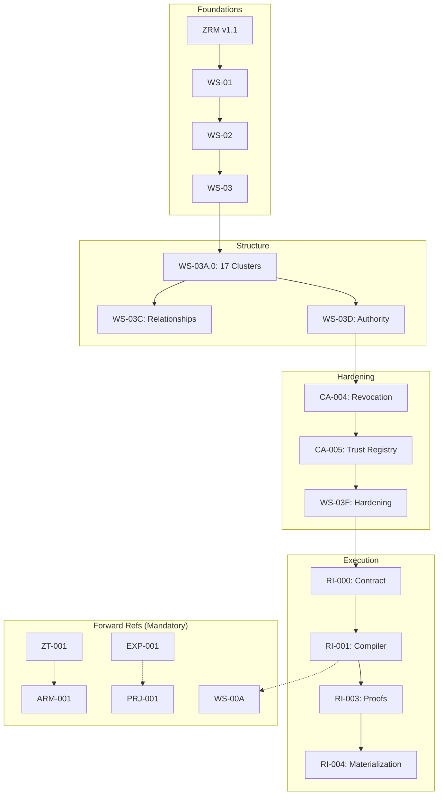

# ZYPPI CONSTITUTIONAL STATE OF THE UNION (v1.1)
## The Authoritative Orientation & Onboarding Dossier for the AI Council
**Status:** Canonical Baseline
**Date:** June 2026
**Scope:** Repository Baseline v1.0 (Execution Era)

---

## 1. Executive Summary

### 1.1 Mission: Intent Distribution Infrastructure
Zyppi is the **Intent Distribution Infrastructure** for the physical internet (Ref: `NORTH-STAR.md`). It bridges the gap between physical interactions (**Touch**) and digital outcomes by preserving the **Asset Reality** across time, jurisdiction, and interface. Unlike legacy event-centric systems, Zyppi treats relationships as permanent and interactions as transient.

### 1.2 The State of the Union: Execution Era
As of June 2026, Zyppi has transitioned from the **Ontology Era** (Phase 0: defining what things are) to the **Execution Era** (Phase 3: enforcing what things do). The "Constitution" is no longer a collection of documents; it is the **Input Specification for a Deterministic Compiler chain** (Ref: `RI-001`, §1, ¶1).

### 1.3 Orientation Objective
This dossier provides a formal audit of what is **Settled Law**, what remains **Unsettled**, and the specific **Mandate** of the AI Council. Reviewers must accept Locked domains as axioms and focus on identifying contradictions, gaps, and ambiguities in Draft or In-Progress domains.

---

## 2. Constitutional Status Dashboard

This dashboard indicates the settlement status of constitutional domains. Discussion is only permitted in **DRAFT**, **IN PROGRESS**, or **GAP** areas. **LOCKED** areas are considered settled law and cannot be challenged without a Phase 0 Reset.

| Domain | Status | Authority | Settlement Date |
| :--- | :--- | :--- | :--- |
| **Ontology & Primitives** | **LOCKED** | `WS-01`, `WS-03F` | June 2026 |
| **Taxonomy (17 Clusters)**| **LOCKED** | `WS-03A.0`, `CA-001`, `A-001` | June 2026 |
| **Relationship Model** | **LOCKED** | `WS-04A.1`, `WS-04B`, `ARM-001` | June 2026 |
| **Authority Model** | **LOCKED** | `WS-03D`, `CA-004`, `WS-03F` | June 2026 |
| **Trust Registry** | **LOCKED** | `CA-005` | June 2026 |
| **Compiler / ACV** | **LOCKED** | `RI-000`, `RI-001` | June 2026 |
| **Population Engine** | **LOCKED** | `RI-004`, `WS-05A-E` | June 2026 |
| **Reasoning Framework** | **LOCKED** | `RSN-001`, `RSN-002` | June 2026 |
| **Registry Publication** | **DRAFT** | `RI-005` | - |
| **Runtime SDK / API** | **IN PROGRESS**| `ROADMAP.md` Phase D | - |
| **Policy Engine** | **GAP** | `PRJ-001` §11 | - |
| **Federation** | **RESERVED** | `RSN-003` §Attestation | - |
| **Marketplace** | **RESERVED** | `RSN-003` §Attestation | - |

---

## 3. Constitutional Completeness Map

Estimates of architectural settling within each pillar based on ratification and locking status.

- **Reality (Assets, Events, Identities, Clusters)**
  ██████████████ 100% (Foundations frozen under `CFR-001`)
- **Execution (Intents, Transactions, Outcomes, Contracts)**
  █████████████░ 95% (Contracts defined; SDKs pending)
- **Compilation (ACV, Determinism, Proofs, Materializer)**
  ██████████████ 100% (RI-000 through RI-004 ratified)
- **Interpretation (Reasoning, Intelligence, Attestation)**
  ███████████░░░ 80% (Framework locked; Blueprints empty)
- **Projection (GS1, DPP, Views, Policy)**
  ██████████░░░░ 75% (Framework locked; Policy engine missing)
- **Runtime (SDK, Federation, Marketplace, Security)**
  ██░░░░░░░░░░░░ 15% (Phase D roadmap only)

---

## 4. Constitutional Decision Register

Settled debates that **MUST NOT** be reopened by the Council without a formal Phase 0 Reset.

| Decision Point | Adopted Result | Rejected Alternative | Authority |
| :--- | :--- | :--- | :--- |
| **Cluster Count** | **17 Clusters** | 15 Clusters | `CA-001`, §1 |
| **Interaction Unit** | **Event** (CL-11) | Signal | `SR-007`, `WS-03F` |
| **Campaign Status** | **Identity + Context**| Core Primitive | `CA-002`, §2 |
| **Time Status** | **CL-13 Cluster** | Graph Metadata | `AMENDMENT A-001`, §6|
| **Inheritance Rule** | **Single-Parent** | Multiple Inheritance | `WS-03A.0`, §8 |
| **Authority Model** | **Singular Anchor** | Composable Tags | `WS-03D`, §Ratification|
| **Registry Role** | **Materializer** | Registry Builder | `RI-004`, §Purpose |
| **Executor Logic** | **Dumb Executor** | Smart Optimizer | `RI-004`, §INV-019 |
| **Serialization** | **RFC 8785 JCS** | Standard JSON | `RI-001`, §28 |
| **Trust Validation** | **Trust Registry** | Implicit Trust | `CA-005`, §3 |

---

## 5. Explicit "Do NOT Revisit" List (The Invariants)

The AI Council is strictly prohibited from proposing "innovation" or "simplification" in the following frozen areas. These are the axioms of the system:

1.  **17-Cluster Taxonomy:** The separation of interpretation (CL-16) from infrastructure (CL-17) is final. (Ref: `CA-001`)
2.  **Single Ownership Rule:** No concept may be owned by more than one cluster. Concept leakage is a constitutional defect. (Ref: `WS-03A.0`, §5, CR-001)
3.  **Single-Parent Taxonomy:** Multi-inheritance is prohibited to ensure deterministic ACV construction. (Ref: `WS-03A.0`, §8, IF-002)
4.  **Deterministic Compilation:** The Three-Compiler Strategy is the primary security and correctness model. (Ref: `RI-000`, Appx J)
5.  **Population Plan Theorem:** The compiler makes all decisions; the registry population engine (Materializer) makes none. (Ref: `RI-004`, §CMP-001)
6.  **Bitemporality:** Historical observations (CL-11) are immutable and never deleted. (Ref: `ZRM v1.1`, §8.2)
7.  **Reality-First Philosophy:** Asset Reality (Referent) is always the authoritative source for Experience (UI). (Ref: `EXP-001`, §3, EXP-CP-001)
8.  **RFC 8785 Canonicalization:** Byte-identical hashing requires strict lexicographical sorting of JSON keys. (Ref: `RI-001`, §28)

---

## 6. Constitutional Risk Register

Structural risks identified during the v1.0 baseline audit that require Council attention.

| Risk | Impact | Reason | Authority |
| :--- | :--- | :--- | :--- |
| **Policy Engine Gap**| **CRITICAL** | PRJ/EXP cannot execute without a formal Policy Constitution. | `PRJ-001`, §11 |
| **Runtime Dead-End** | **HIGH** | The execution chain currently terminates at Publication (RI-005). | `ROADMAP.md` |
| **KRM Empty** | **HIGH** | Reasoning (RSN-001) cannot route intents without a populated KRM. | `RSN-001`, §10 |
| **Revocation Loop** | **MEDIUM** | Authority cascades (CA-004) may allow cyclic revocation loops. | `CA-004`, §3 |
| **Knowledge Debt** | **MEDIUM** | Rationale for BLAKE2b and RFC 8785 is missing ADR documentation. | `ROADMAP.md` |

---

## 7. AI Council Mandate

### 7.1 What this Review is NOT
- **DO NOT** redesign the core ZRM ontology or primitives.
- **DO NOT** invent alternative cluster mappings or names.
- **DO NOT** propose implementation "shortcuts" that bypass the Determinism Budget.
- **DO NOT** attempt to simplify the RI series at the cost of mathematical proof.

### 7.2 What this Review IS
- **DETECT** contradictions between constitutional layers (e.g., WS vs CA vs RI).
- **IDENTIFY** missing constitutional coverage (Gaps like Policy Runtime).
- **EXPOSE** duplicated authority or concepts across clusters.
- **VALIDATE** determinism invariants and entropy isolation in the compiler chain.
- **ENFORCE** the "Dumb Executor" principle across all materialization phases.
- **AUDIT** the supersession chain to ensure no "Zombie" clauses remain active.

---

## 8. Constitutional Maturity Matrix

| Domain | Frozen | Proven | Implemented |
| :--- | :--- | :--- | :--- |
| **Ontology** | ✓ (`WS-01/02`) | ✓ (`SIA-001`) | ✓ (`CSM Index`) |
| **Registry** | ✓ (`WS-02A`) | ✓ (`17 Cluster`) | ✓ (`RI-004` Spec) |
| **Compiler** | ✓ (`RI-000/01`) | ✓ (`ACV Spec`) | **In Progress** |
| **Reasoning** | ✓ (`RSN-001`) | ✗ (No Blueprints)| ✗ |
| **Runtime** | ✗ | ✗ | ✗ |
| **Federation** | ✗ | ✗ | ✗ |

---

## 9. Constitutional Vocabulary Freeze

### 9.1 Forbidden/Deprecated Terminology
To prevent terminology regression and "Ontological Drift," AI Reviewers MUST NOT use or accept the following:

| Deprecated Term | Canonical Term | Authority |
| :--- | :--- | :--- |
| **Signal** | **Event** (CL-11) | `SR-007`, `WS-03F` |
| **Journey** | **Inference Pattern** (CL-16) | `SR-008`, `WS-03F` |
| **Fact** | **Reality Claim** (CL-09) | `SR-009`, `WS-03F` |
| **Snapshot** | **ACV** (Active Const. View)| `RI-000`, `WS-00A` |
| **Builder** | **Materializer** | `RI-004` |
| **Primitive Campaign**| **Campaign Identity** | `CA-002` |
| **Context Tag** | **Authority Anchor** | `WS-03D` |

---

## 10. Guiding Principles (The Immutable Laws)

1.  **Traffic Is Sacred:** Redirect performance is the primary path; intelligence must never block traffic. (Ref: `TECH-ARCHITECTURE.md`, §2)
2.  **Infrastructure Before Features:** Acquisition via utilities, value retention via Registry. (Ref: `PRD.md`, §3)
3.  **Identity != Referent:** Digital representation (zID) is distinct from the physical object. (Ref: `WS-01`, §2)
4.  **Relationships are First-Class:** Relationships possess independent identity and lifecycle. (Ref: `ARM-001`)
5.  **Auditability of Meaning:** Every system decision must trace to a constitutional clause. (Ref: `RI-001`, §31)
6.  **Transport Independence:** Trust is derived from math (Merkle roots), not hostnames or URLs. (Ref: `RI-005`, §3)
7.  **Actor Parity:** AI Agents and Humans possess equal constitutional standing. (Ref: `ZT-001`, §3)

---

## 11. "How to Read the Constitution" (The Logic Sequence)

AI Reviewers MUST follow this sequence to avoid implementation-first bias:

1.  **The Goal:** Read `NORTH-STAR.md` and `FOUNDING-PRINCIPLE.md`.
2.  **The Logic:** Read `ZRM v1.1`.
3.  **The Structure:** Read `WS-03A.0` (Cluster Ownership) and `WS-03C` (Relationships).
4.  **The History:** Read `SR-001` (Supersessions) and `CA-001 to CA-005` (Amendments).
5.  **The Execution:** Read `RI-000` (Execution Contract) and `RI-001` (Compiler).
6.  **The Delivery:** Read `ZT-001` (Touch) and `EXP-001` (Experience).
7.  **The Validation:** Verify against `WS-05D` (Independent Validation).

---

## 12. Complete Dependency Graph

---

## 13. Ownership Map (Concept Sovereignty)

Every idea in Zyppi has exactly one owner (Ref: `WS-03A.0`, §5, CR-001).

| Concept | Unique Owner (Cluster) | Authority |
| :--- | :--- | :--- |
| **Reality State** | CL-17 Graph Core | `WS-03A.0`, §10 |
| **Digital ID (zID)** | CL-04 Identity | `WS-03A.2`, §1 |
| **Fact Assertion** | CL-11 Event | `WS-03A.8`, §1 |
| **Inference/Risk** | CL-16 Intelligence | `WS-03A.9`, §1 |
| **Auth Context** | CL-04 Identity | `SR-012`, `WS-03F` |
| **Temporal Logic** | CL-13 Temporal | `AMENDMENT A-001` |
| **Attestation** | RSN-003 (Primitive)| `RSN-003` |
| **Blueprint** | RSN-001 | `RSN-001`, §8 |
| **System Rules** | CL-08 System | `WS-03A.0`, §4 |

---

## 14. Remaining Open Constitutional Questions

| Question | Current State | Blocking? | Owner |
| :--- | :--- | :--- | :--- |
| **Policy Language Spec** | UNDEFINED (Rego/CEL?) | **YES** | RSN / PRJ |
| **Federation Model** | RESERVED | NO | Future (v2.0) |
| **Marketplace Governance**| RESERVED | NO | Future (v2.0) |
| **Thread Scheduling** | PROHIBITED | NO | RI-000 (Appx F) |
| **Cross-Tenant Sync** | UNDEFINED | NO | Federation |

---
*Orientation Dossier v1.1 complete. Reconstructed from repository evidence by Jules.*
